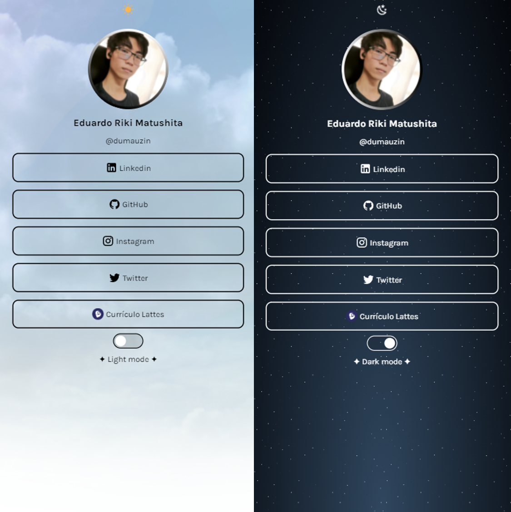

<!-- PROJETO -->

<h1 align="center"><strong>Linktree ✨</strong></h1>

<h3 align="center">Projeto desenvolvido para a empresa júnior Haken</h3>

  <a href="#sobre">Sobre o projeto</a>&nbsp;&nbsp;&nbsp;|&nbsp;&nbsp;&nbsp;
  <a href="#tecnologias">Tecnologias utilizadas</a>&nbsp;&nbsp;&nbsp;|&nbsp;&nbsp;&nbsp;
  <a href="#planejamento">Planejamento</a>&nbsp;&nbsp;&nbsp;|&nbsp;&nbsp;&nbsp;
  <a href="#contato">Contato</a>

---

---

<!-- SOBRE O PROJETO -->

<h2 align="center"> <strong> Sobre o projeto </strong> </h2>

 

&nbsp;&nbsp;&nbsp;&nbsp;Este é um projeto de código aberto com o intuito de representar o Linktree pessoal de Eduardo Riki Matushita, discente do 2º período da Universidade Tecnológica Federal do Paraná (UTFPR).

[ `Website estático` ]

[ `Responsivo` ]

[ `Possui *light mode* e *dark mode*` ]

[ `Código apenas em português` ]

[ `Estilo de escrita utilizado: *snake case*` ]

 

---

<!-- TECNOLOGIAS UTILIZADAS -->

<h2 align="center"> <strong> Tecnologias utilizadas </strong> </h2>

 

- HTML
- CSS
- JavaScipt

 

---

<!-- USAGE EXAMPLES -->

<h2 align="center"> <strong> Planejamento do projeto </strong> </h2>

 

- Prototipagem da tela: `PowerPoint`
- Planejamento: `https://trello.com/b/WXIIfIkS/haken-projeto-individual`

 

---

<!-- CONTATOS -->

<h2 align="center"> <strong> Contatos </strong> </h2>

 

E-mail - eduardomatushita1@gmail.com

Linkedin: https://www.linkedin.com/in/eduardo-riki-matushita/

---

[ <a href="#topo">Voltar para o topo</a> ]
